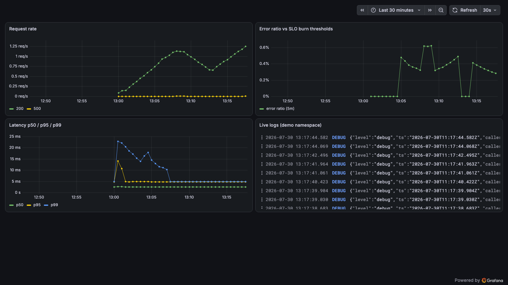
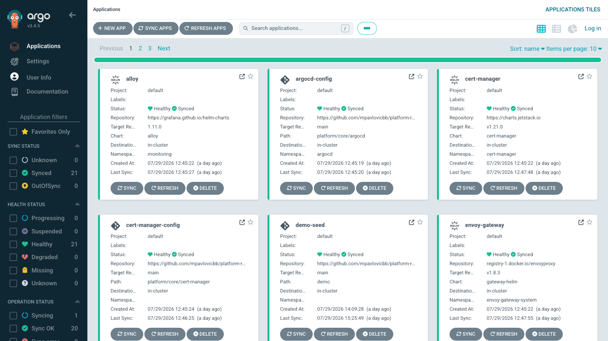

# platform-reference

A production-shaped internal developer platform that runs on any cloud — or none.
One command boots the whole thing — GitOps delivery, policy, secrets, gateway,
a full metrics/logs/alerting stack, and a generated network floor — on a
laptop in under 10 minutes, measured.

[](https://github.com/mpavlovicbb/platform-reference/actions/workflows/validate.yaml)
[](https://mpavlovicbb.github.io/platform-reference/)
[](LICENSE)


| Measured boot | GitOps-managed applications | Credentials in git |
|:---:|:---:|:---:|
| under 10 minutes — 587 s, measured | 22, from one root | 0, enforced by three layers |

## The problem

Most platform teams are a ticket queue: developers wait days for clusters,
environments drift into unrepeatable snowflakes, and every capability is welded
to one cloud vendor's managed services. This repository is a working counterexample.
Everything — delivery, ingress, secrets, policy — reconciles from a single Git
root, and the cloud-specific surface is confined to a thin layer that swaps
between a laptop, Hetzner, AWS, or Azure. My production work of this shape lives
in private employer repositories; this reference makes that judgment publicly
reviewable.

## Architecture


The boundary discipline is the point: swapping Vault for a cloud secrets manager
touches one ClusterSecretStore; swapping NodePort for a LoadBalancer touches one
EnvoyProxy resource; everything above those seams is identical everywhere.

## What it looks like running

Golden signals from the seeded workloads — request curves, the flaky tenant's
error spikes against SLO burn thresholds, latency percentiles, live logs:



Every application reconciling from one Git root, viewed anonymously (read-only,
localhost-only):



Both are reproducible from the repo: `make up`, `make seed`, and both UIs are
on localhost with credentials from `make creds`.

## What this demonstrates

- A developer-facing platform where onboarding a workload is a Git merge, not a ticket
- Guardrails that fail fast: bad manifests are rejected at admission with actionable messages
- Secrets that never touch the repository — generated at runtime, delivered through a swappable provider boundary
- Boot-from-nothing reproducibility as a required PR check: CI boots the entire
  platform in kind against each revision's own manifests and smoke-tests the
  guardrail claims before anything merges
- Failure-driven hardening: the commit history contains the real ordering deadlocks and drift bugs a clean-boot gate surfaced, each fixed declaratively

## For engineers — start here

The deep-reading layer lives on the
**[docs site](https://mpavlovicbb.github.io/platform-reference/)**: the
[fifteen decision records](https://mpavlovicbb.github.io/platform-reference/adr/)
(each with "what we gave up") and the
[three migration playbooks](https://mpavlovicbb.github.io/platform-reference/playbooks/).
The code itself:

| Interest | Where |
|---|---|
| Delivery topology | [bootstrap/argocd/root-app.yaml](bootstrap/argocd/root-app.yaml), [platform/root/](platform/root/) |
| Boot mechanics and health gating | [scripts/up.sh](scripts/up.sh) |
| Policy set and enforcement scoping | [platform/core/kyverno-policies/](platform/core/kyverno-policies/) |
| Secrets chain | [platform/core/external-secrets/](platform/core/external-secrets/), [platform/core/vault/](platform/core/vault/) |
| Ingress via Gateway API | [platform/core/gateway/](platform/core/gateway/) |
| CI: lint, schemas, policy, misconfig | [.github/workflows/validate.yaml](.github/workflows/validate.yaml), [policies/](policies/) |
| CI: full-platform e2e per PR | [.github/workflows/e2e.yaml](.github/workflows/e2e.yaml), [scripts/ci/e2e-publish-ref.sh](scripts/ci/e2e-publish-ref.sh) |
| Signed SBOMs on releases | [.github/workflows/release.yaml](.github/workflows/release.yaml) |
| Cloud paths: substrate contract + Cluster API | [infrastructure/](infrastructure/) |

## Quickstart

Prerequisites: Docker with 8 GB+ RAM, kind, kubectl, helm, jq.

```sh
git clone https://github.com/mpavlovicbb/platform-reference
cd platform-reference
make up      # preflight, cluster, ArgoCD, every app Synced+Healthy, URLs printed
make status  # sync and health of all applications
make down    # full teardown, no orphans
```

Try the guardrails on the running stack:

```sh
kubectl run bad --image=nginx:latest -n demo        # rejected by policy
curl -H "Host: podinfo.platform.local" localhost:8080   # routed through Envoy
curl -k --resolve podinfo.platform.local:8443:127.0.0.1 \
  https://podinfo.platform.local:8443/              # TLS from the local issuer
kubectl -n demo get secret demo-config              # materialized from Vault
kubectl -n demo get networkpolicy                   # the generated network floor
```

Forking? Run `scripts/fork-init.sh` first — ArgoCD syncs the URLs in the
manifests, not your checkout.

Grafana (credentials printed by `make up`) serves the golden-signals dashboard
at `http://grafana.platform.local:8080`; SLO burn-rate alerts on the demo
workload fire end to end into Alertmanager.

`make seed` adds living signal: a traffic generator, a deliberately flaky
tenant tripping error panels, and a queue-worker with sawtooth depth — three
distinct curve shapes, all reproducible from the repo.

Onboarding a tenant is one file. [PR #14](https://github.com/mpavlovicbb/platform-reference/pull/14)
is the proof: a single YAML under `platform/tenants/` merged, and the
ApplicationSet produced the namespace (policy labels included), the workload,
and the scrape config with no other change.

## Repository layout

```
bootstrap/    kind cluster config; ArgoCD install and the one hand-applied Application
platform/
  root/       app-of-apps: every Application the platform runs, including the
              demo tenant workload (podinfo) the diagram and quickstart exercise
  core/       cert-manager, vault, external-secrets, gateway, kyverno policies,
              observability (SLO rules, dashboards as code), namespaces
  tenants/    one file per tenant — the golden path's entire onboarding surface
demo/         seed workloads: queue-worker (built into the local registry),
              traffic generator, and the opt-in seed Application
scripts/      up / down / status / creds / seed / record-cast, preflight and health gated
docs/         the docs site source: ADRs, playbooks, architecture — published at
              mpavlovicbb.github.io/platform-reference
```

## Roadmap and known limitations

Built in phases; each phase leaves `make up` green and ships as a tagged
release. Done: bootable skeleton (phase 1, v0.1.0), core platform (phase 2,
v0.2.0), observability — kube-prometheus-stack, Loki, Alloy, SLO burn-rate
alerting (phase 3, v0.3.0), tenant golden path and seeded demo signals
(phase 4, v0.4.0), CI e2e and supply chain — every PR boots the whole
platform, releases ship cosign-signed SBOMs (phase 5, v0.5.0), cloud paths —
Terraform substrate modules behind one shared contract plus Cluster API
manifests for Hetzner, AWS, and Azure, validated and linted in CI, never
CI-applied (phase 6, v0.6.0) — plus a merged adversarial hardening pass over
scripts, policies, and delivery ordering. The remaining phase is tracked as
[issues under milestones](https://github.com/mpavlovicbb/platform-reference/milestones).

Not here yet, and known:

- The cloud paths are validated references, not battle-tested deployments —
  no CI applies them, and they say so in their READMEs
- The migration playbooks carry review markers where real-world figures
  belong; the pattern is complete, the numbers are being filled in
- Vault runs in dev mode and ArgoCD serves plaintext on localhost — deliberate
  for local use, documented in [SECURITY.md](SECURITY.md), unsuitable for
  internet-facing deployment as-is

## License

Apache-2.0. See [LICENSE](LICENSE).
