# Architecture

Three layers, three seams.

## Layers

**Cluster lifecycle.** Locally and in CI, kind: single node, local registry
sidecar, host port mappings — boots in minutes, faithful enough that the
whole platform runs on it. On real infrastructure, Cluster API: Terraform
lays the substrate (network, node prerequisites, object storage) behind a
shared variable/output contract, and CAPH/CAPA/CAPZ grow identical
clusters on Hetzner, AWS, or Azure.

**Delivery.** One hand-applied root Application; everything else is a
child. Platform components are curated Application files — each one a
complete, diffable delivery contract. Tenants are generated: an
ApplicationSet turns one YAML file in `platform/tenants/` into a namespace
(policy labels included), a workload, and scrape configuration.

**Day-2 platform.** Envoy Gateway on the Gateway API as the single
entrypoint, with route attachment restricted to platform-labelled
namespaces. External Secrets behind one ClusterSecretStore. Kyverno
enforcing tenant guardrails at admission, mirrored by Conftest at review.
kube-prometheus-stack, Loki, and Alloy with dashboards as code and
multi-window burn-rate SLO alerting.

## The seams

The cloud-specific surface is confined to three named places, and swapping
a cloud means touching exactly them:

| Seam | Local | Cloud |
|---|---|---|
| Substrate | Docker/kind, scripted | Terraform module per cloud, one contract |
| Secrets backend | Vault dev mode, runtime token | Secrets Manager / Key Vault, workload identity |
| Gateway data plane | NodePort pinned to host ports | LoadBalancer, one EnvoyProxy resource |

Everything above the seams is byte-identical everywhere — which is what
lets CI boot the real platform on every pull request and call it proof.

## Trust chain

Zero credentials in git, enforced three times (gitignore, pre-commit
gitleaks, full-history CI scan). Every third-party version pinned: charts,
images, actions to commit SHAs, Terraform providers with committed locks.
Releases ship cosign-signed SBOMs. Six required checks stand between any
change and `main`, and one of them is the entire platform booting from
nothing.
